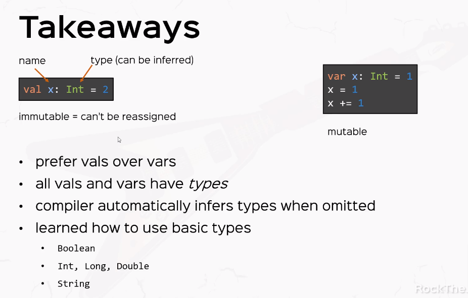

1. val's are immutable, you can't reassign the values
they are just like const or final in java.
2. types of val's are optional, in this case compiler will infer the type automatically.
3. you can give a semicolon, but its optional.In case you want to write two expression on the same line, they should be separated by semicolon.
4. variables unlike val's can be reassigned. variables are also known as side effects.