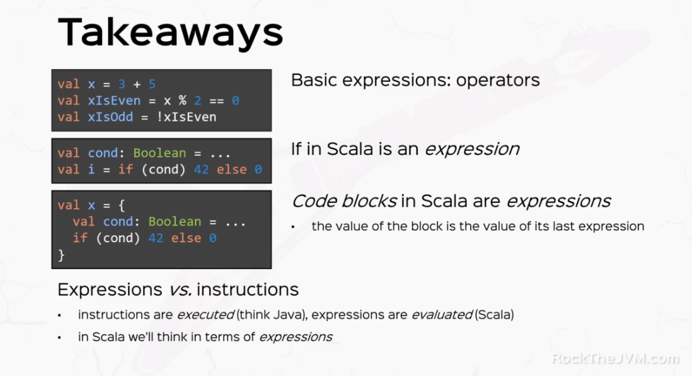

1. expressions - give me the value of something
2. instructions - do something
   
Whatever has a value, e.g. 2 + 1, is an expression. Whatever "does" something, e.g. print something to the console, is an instruction.

Working with instructions means you "tell" the computer what to do, step by step (one step = one instruction). This is how we usually program in the more conventional style with C++, Java, Python and many other languages. We say instructions are executed because that's what the processor actually does.

By contrast, an expression is a combination of tokens which can be turned into a value. For example, 1 + 2 is an expression, and its value is 3. If we define a function f(x: Int) = x * x, then f(4) is an expression and its value is 16. We say expressions are evaluated, which means we can turn them into values.

Instructions aren't evaluated, which means, for example, that you can't obtain a value out of printing something to console: what would be the value of printing "I saw a cat"? Would it be 2? Would it be 53? It wouldn't make too much sense to give one particular concrete value to an instruction.

But everything in Scala is an expression - even things which work the way instructions do. Now because it doesn't make sense to give concrete values to instructions, Scala has this "fictional value" called Unit, which it attributes to all instructions. So the way Scala deals with instructions is that it "evaluates" them to Unit, essentially "converting" them into expressions.